# Minimal Physics Simulator

**A First-Principles Physics Engine for Numerical Analysis and Performance Engineering**


---

## 📄 Complete Project Report

**For the full detailed report with all experiments, analysis, and findings, see:**  
📖 **[Complete Project Report](Minimal_Physics_Simulation.pdf)**

This README provides a concise overview. The full report contains comprehensive details on all 5 phases, experimental results, performance benchmarks, and in-depth analysis.

---

## Table of Contents

1. [Overview](#overview)
2. [System Architecture](#system-architecture)
3. [Simulation Data Flow](#simulation-data-flow)
4. [Key Achievements](#key-achievements)
5. [Performance Scaling](#performance-scaling)
6. [Key Findings](#key-findings)
7. [Installation & Usage](#installation--usage)
8. [File Structure](#file-structure)

---

## Overview

The **Minimal Physics Simulator** is a comprehensive research project investigating numerical integration methods, performance optimization strategies, and hardware utilization patterns in computational physics. Built from first principles without black-box libraries, providing complete transparency into algorithm selection and system performance.

### Research Objectives

- **Numerical Stability**: How integrator selection affects energy conservation and long-term behavior
- **Performance Engineering**: Characterize compute-bound vs memory-bound regimes across scales
- **Systems Design**: Build modular, deterministic infrastructure for reproducible experiments
- **Real-World Robustness**: Stability under precision constraints, timing jitter, and latency

### Industrial Applications

Molecular dynamics, reinforcement learning environments, orbital mechanics, game physics, robotics control loops, and sim-to-real transfer.

---

## System Architecture


---

## Simulation Data Flow


---

## Key Achievements

**5 Phases Completed** (see [full report](docs/PROGRESS_REPORT.MD) for details):

### Phase 1: Integrator Stability Analysis ✅
- **Discovery**: Symplectic integrators (Verlet, Semi-Implicit Euler) dramatically outperform higher-order non-symplectic methods (RK4) for Hamiltonian systems
- **Result**: Verlet with dt=0.25 is more stable than RK4 with any dt
- **Validation**: 100,000+ steps without divergence

### Phase 2: Performance Scaling & Optimization ✅
- **Throughput**: 1.38B particle-steps/sec (NumPy vectorized)
- **Optimization**: 73% speedup from memory layout changes alone (Structure-of-Arrays)
- **Scaling**: 1 → 100,000 particles across Python/NumPy/PyTorch backends

### Phase 3: Error Analysis & Validation ✅
- **Accuracy**: Phase error grows as O(dt²) for Verlet
- **Energy Conservation**: <0.001% drift over 100K steps
- **Analytical Validation**: Bitwise comparison against closed-form solutions

### Phase 4: RL-Style Batched Rollouts ✅
- **Throughput**: 44.3M transitions/sec (4096 envs × 1024 steps)
- **Memory**: 68 MB with Structure-of-Arrays layout
- **Determinism**: 100% bitwise reproducibility across runs

### Phase 5: Real-World Stability Testing ✅
- **Precision**: float32 vs float64 <0.02% difference (precision rarely limits stability)
- **Perturbations**: Latency 100× more destabilizing than jitter, 10,000× more than precision
- **Phase Drift**: 1% jitter causes 3000% velocity error despite 0.5% energy drift

---

## Performance Scaling

### Regime Transitions


### Stability vs Performance Hierarchy

```mermaid
graph TD
    %% 1. GLOBAL STYLING
    classDef default font-family:'Google Sans',Arial,sans-serif,color:#202124;

    %% 2. COLOR CLASSES (Severity Gradient)
    %% Critical (Latency) - Red
    classDef gRed fill:#FCE8E6,stroke:#EA4335,stroke-width:2px,color:#B31412;
    
    %% High (Jitter) - Orange (Google Material Orange)
    classDef gOrange fill:#FFF3E0,stroke:#F9AB00,stroke-width:2px,color:#E65100;
    
    %% Medium (Async) - Yellow
    classDef gYellow fill:#FEF7E0,stroke:#FBBC04,stroke-width:2px,color:#B06000;
    
    %% Low (Float) - Green
    classDef gGreen fill:#E6F4EA,stroke:#34A853,stroke-width:2px,color:#137333;

    %% 3. THE DIAGRAM
    subgraph Destabilizing ["<b>Impact on Control Stability</b><br/>&nbsp;"]
        direction TB
        
        L("Latency<br/>100× impact"):::gRed
        J("Jitter<br/>10-100× impact"):::gOrange
        A("Async Stepping<br/>2-5× impact"):::gYellow
        P("Float Precision<br/><1% impact"):::gGreen
    end
    
    %% 4. CONNECTIONS
    %% Thick arrows to show the flow of reducing impact
    L ==> J ==> A ==> P

    %% 5. SUBGRAPH STYLING
    %% White background, clean dashed border
    style Destabilizing fill:#ffffff,stroke:#e0e0e0,stroke-width:2px,stroke-dasharray: 5 5,color:#5f6368
```



### Throughput Results

| Backend | Particle Count | Throughput (M/sec) | Efficiency |
|---------|----------------|-------------------|------------|
| Python Loop | 1,000 | 0.5 | Baseline |
| NumPy Vectorized | 100,000 | 1,380 | 2760× |
| PyTorch CPU | 100,000 | 941 | 1882× |

**Memory Bandwidth Utilization**: NumPy achieves 22.1 GB/s (43% of DDR4 theoretical max 51.2 GB/s)

---

## Key Findings

### 1. Symplectic Structure > Truncation Error Order
For Hamiltonian systems, symplectic integrators (Verlet, Semi-Implicit Euler) preserve geometric phase space properties, preventing artificial energy drift even with large timesteps. **Verlet beats RK4 at any dt**.

### 2. Memory Layout Dominates Performance
73% throughput gain from Structure-of-Arrays layout and in-place updates alone. **842M → 1.38B particle-steps/sec** with zero algorithmic changes.

### 3. RAM Capacity Limits RL Scaling
Batched RL rollouts are **not compute-limited** (CPU <50%) or **bandwidth-limited** (22.1/51.2 GB/s), but **RAM-capacity-limited**. At (4096 envs × 1024 steps), memory usage is 68 MB, scaling to 544 MB at 8× scale.

### 4. Latency > Jitter > Precision for Stability
Real-world control systems: **Latency is 100× more destabilizing than jitter**, and **10,000× more than float precision**. Invest in low-latency infrastructure before worrying about float32 vs float64.

### 5. Phase Drift Dominates Long-Horizon Control
Even with <1% energy conservation, **phase desynchronization causes 3000% velocity error** over 1000 steps with 1% jitter. For trajectory tracking and sim-to-real transfer, **phase accuracy is paramount**.

### 6. Determinism is Achievable
**100% bitwise reproducibility** through fixed-precision arithmetic (float64), fixed evaluation order (single-threaded), and zero environment dependencies. Validated across 10,000+ runs on Windows/Linux.

---

## Installation & Usage

### Prerequisites
- **Python**: 3.12+
- **OS**: Windows, Linux, macOS

### Installation

```bash
git clone <repository-url>
cd Minimal_Physics_Simulator
pip install -r requirements.txt
```

### Dependencies
- `numpy >= 2.4.2` — Vectorized numerical operations
- `torch >= 2.10.0` — PyTorch backend (optional)
- `matplotlib >= 3.10.8` — Visualization
- `pandas >= 3.0.0` — Data analysis

### Quick Start: Simple Harmonic Oscillator

```python
from src.mpe.core import Simulator, State1D
from src.mpe.integrators import VelocityVerlet
from src.mpe.forces import Spring

# Setup
simulator = Simulator(
    integrator=VelocityVerlet(),
    force_model=Spring(k=10.0),
    mass=1.0
)

# Initial condition
initial_state = State1D(x=1.0, v=0.0)

# Run simulation
positions, velocities = simulator.run(
    initial_state=initial_state,
    dt=0.01,
    steps=1000
)

print(f"Final position: {positions[-1]:.4f}")
```

### Run Experiments

**Compare integrators**:
```bash
python src/experiments/stability_table.py
```

**Batch performance benchmark**:
```bash
python src/experiments/throughput_scaling.py
```

**Real-world stability test**:
```bash
python src/experiments/realworld_stability_test.py
```

---

## File Structure

```
Minimal_Physics_Simulator/
├── README.md                    # This file
├── docs/
│   └── PROGRESS_REPORT.MD      # Complete detailed report
├── src/
│   ├── mpe/                    # Main physics engine package
│   │   ├── core/               # State, Simulator, TimeKeeper
│   │   ├── integrators/        # Euler, Semi-Implicit, Verlet, RK4
│   │   ├── forces/             # Spring, Gravity, Damped, Composite
│   │   ├── batch/              # Python, NumPy, PyTorch backends
│   │   ├── analysis/           # Energy, error, stability metrics
│   │   ├── rl/                 # Batch environments, rollout storage
│   │   └── realworld/          # Jitter, latency, async effects
│   └── experiments/            # All experimental scripts
│       ├── stability_table.py
│       ├── throughput_scaling.py
│       ├── energy_drift.py
│       ├── error_growth.py
│       ├── oscillator_stability.py
│       ├── rl_roll_test.py
│       └── realworld_stability_test.py
└── plots/                      # Generated visualization outputs
```

### Module Dependency Graph


---

## Future Roadmap

### Phase 6: GPU Acceleration (Planned)
- CUDA kernels for custom integrators
- GPU memory bandwidth vs compute utilization
- Expected: 10-100× speedup for N > 100K particles

### Phase 7: 2D/3D Rigid Body Dynamics (Planned)
- 2D/3D state vectors with rotation (quaternions)
- Collision detection and response
- Applications: Game physics, robotics manipulation

### Phase 8: Advanced Integrators (Research)
- Leapfrog integrator (astronomy)
- RESPA (multiple timesteps)
- Symplectic partitioned Runge-Kutta

---

## References

### Numerical Methods
- Hairer, E., Lubich, C., & Wanner, G. (2006). *Geometric Numerical Integration*.
- Leimkuhler, B., & Reich, S. (2004). *Simulating Hamiltonian Dynamics*.

### Performance Engineering
- Hennessy, J. L., & Patterson, D. A. (2017). *Computer Architecture: A Quantitative Approach*.
- Williams, S., Waterman, A., & Patterson, D. (2009). "Roofline: An Insightful Visual Performance Model."

### Reinforcement Learning Systems
- Liang, E., et al. (2018). "RLlib: Abstractions for Distributed Reinforcement Learning."
- Makoviychuk, V., et al. (2021). "Isaac Gym: High Performance GPU-Based Physics Simulation."

---

## Skills Demonstrated

This project demonstrates practical expertise in:
- **Numerical methods**: Symplectic integrators, error analysis, stability theory
- **Performance engineering**: Vectorization, memory layout optimization, profiling
- **Systems architecture**: Modular design, batch processing, determinism
- **GPU batching strategies**: Memory engineering for RL rollouts
- **Control-loop reliability**: Timing perturbation effects, phase accuracy

These are the exact competencies required at robotics companies (Boston Dynamics, Tesla), simulation infrastructure teams (NVIDIA, Epic Games), RL infrastructure teams (OpenAI, DeepMind), and GPU systems teams.

---

## License

MIT License - See LICENSE file for details.

---

**For complete experimental details, results, and analysis, see the [Full Project Report](Minimal_Physics_Simulation.pdf).**
